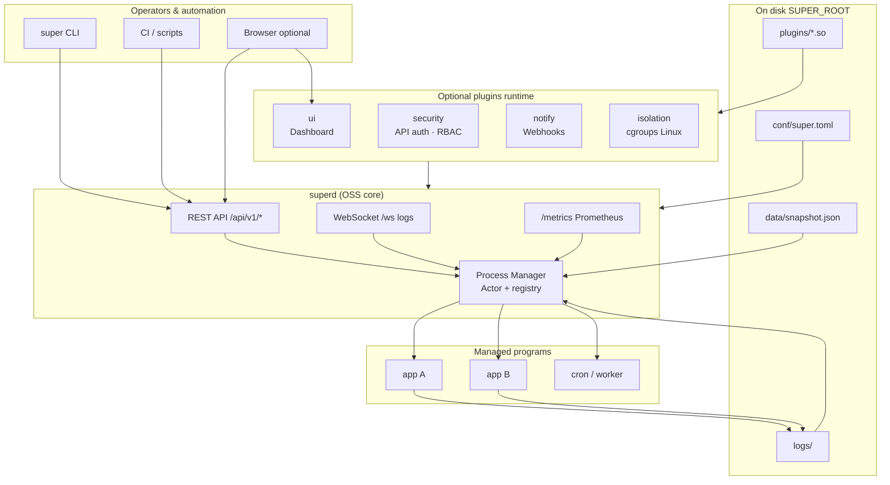

Project Super was built to solve specific architectural shortcomings in existing process managers like Supervisor (Python) and PM2 (Node.js). We don't just manage processes; we engineer for edge cases, memory constraints, and high-concurrency storms.

Here is an inside look at the architectural decisions that make Super fundamentally different.

## System architecture (overview)

Super is a **single static binary** (`superd`) that runs on your server or container. You configure it with `super.toml`, manage programs through the **CLI** or **HTTP API**, and optionally unlock subscription features by adding a signed license key and official plugin libraries — no separate “enterprise” build.

### How the pieces fit together

| Component | Role |
| :--- | :--- |
| **`superd`** | Long-running daemon: spawns processes, health checks, OTA updates, persistence, API. |
| **`super` CLI** | Local or remote control against the API (create/start/logs/stack). |
| **REST + WebSocket** | Declarative control and live log streaming for automation. |
| **`/metrics`** | Prometheus scrape endpoint (OSS). |
| **`conf/super.toml`** | Daemon settings, optional `[license].key`, `auth_secret` when subscribed. |
| **`data/snapshot.json`** | Durable program registry (atomic writes). |
| **`logs/`** | Daemon and child process logs (rotation configurable). |
| **Plugins** | Optional `.so` / `.dylib` loaded at runtime after license verification. |

**OSS (default):** loopback-first bind, no built-in dashboard, API open only on the bind address you configure. See [Configuration — OSS security defaults](/docs/02-essentials/configuration#oss-security-defaults-fail-closed).

**Subscription:** same `superd` binary; add `[license].key`, deploy plugin libraries under `plugins/`, and set `auth_secret`. The **`security` plugin is included with every subscription** and is required for licensed startup — API token auth and RBAC then protect the control plane. See [Authentication](/docs/05-advanced-management/authentication#licensed-deployments-require-security) and the [Feature matrix](/docs/07-editions/feature-matrix/).

**Typical control flow:** an operator or pipeline sends `POST /api/v1/programs` (or `super add`) → the Manager validates config → spawns the child in its own **process group** → streams stdout/stderr to disk and WebSocket → health probes and dependency rules decide when downstream services start. Shutdown and OTA paths use the same Manager mailbox so state stays consistent under load.

For day-to-day configuration rather than internals, start with [Configuration](/docs/02-essentials/configuration) and [Quick Start](/docs/01-getting-started/quick-start/).

## 1. Why Rust?

We chose Rust not for the hype, but for **Memory Safety** and **Predictability**.

*   **Zero GC Pauses**: Unlike Go, Java, or Node.js, Rust has no Garbage Collector. This ensures the supervisor process never "freezes" for a few milliseconds to clean up memory—a critical property when monitoring high-frequency trading apps or real-time control systems.
*   **Memory Footprint**: A statically compiled Super binary (via `musl` with LTO and stripped symbols) typically consumes **< 5MB** of RAM. This is crucial for edge devices with 256MB RAM where every megabyte counts.
*   **Concurrency**: Rust's "Fearless Concurrency" allows us to handle log streams, health checks, and API requests in parallel without race conditions.

## 2. OS Internals & Lifecycle Governance

### Process Groups (PGID) over Single PIDs
Why do we kill by Process Group (`-PID`) instead of just the main PID? 
If a user script (`start.sh`) spawns a Java process and Super only kills the shell script, the Java process becomes an "orphaned" zombie holding onto port 8080. 
Before executing a payload, Super sets a new process group (`process_group(0)`). During shutdown, we send `SIGTERM` to the **negative PID** (`kill(-PID, SIGTERM)`), effectively broadcasting the signal to the entire process tree, leaving zero orphans.

Applications must not break out of this group — see the [Process Management Contract](/docs/02-essentials/process-management-contract).

### The 10-Second SIGKILL Timeout
We support graceful shutdowns, but we never trust user code implicitly. If a process catches `SIGTERM` but enters a deadlock or refuses to exit, it could hang the manager indefinitely. Super isolates this by spawning a 10-second detached timer. If the process is still alive when the timer pops, Super ruthlessly issues a `SIGKILL` to the process group, ensuring system resources are always reclaimed.

### Differentiating "Crashes" from "Completed Jobs"
Older process managers assume *any* exit means a crash. Super respects POSIX standards:
*   **Exit Code `0`**: Treated as a successful completion (Stopped). It does not trigger a restart. This makes Super perfect for Cron jobs and one-off tasks (like database migrations).
*   **Exit Code `!= 0`**: Treated as a Crash. Super triggers an exponential backoff retry and fires an alert.

## 3. Concurrency & The Actor Model

Super uses an **Actor-like architecture** based on Tokio `mpsc` channels.

*   **Single Source of Truth**: There is only *one* owner of the system state (`ProcessRegistry`) running in a single event loop. All external actions (API requests, Health Checks, Exits) are converted into `Command` enums and sent to the Manager's mailbox.
*   **Preventing Deadlocks**: The core mailbox has a massive capacity (2048). Furthermore, non-critical background tasks (like periodic CPU/Memory metric collection) use `try_send` instead of blocking. If the manager is saturated under a massive API load, metrics are silently dropped rather than causing a system-wide deadlock.
*   **Anti-Avalanche (Staggered Startup)**: When a server reboots, starting 30 microservices simultaneously causes a massive CPU/IO spike, often leading to health-check timeouts and crash loops. Super implements **Staggered Startup (Jitter)**. It pauses for 100ms between each process spawn, smoothing out the IO spike and bringing the entire cluster online gracefully.

## 4. Security & Crash Safety

How does Super guarantee safety during sudden kernel panics or power losses? We borrowed concepts from database design and Unix philosophy.

### Transactional OTA & WAL (Write-Ahead Log)
When performing an over-the-air binary update, we write a **WAL Record** (the `restore_path`) to disk *before* touching the binary.
If power is lost mid-update, Super reads the WAL upon reboot, notices an unfinished transaction, and triggers an automatic rollback to the known-good backup. 

### Atomic State Swaps
When saving state to `snapshot.json`, Super writes to a `.tmp` file, calls `fs::sync()`, and then performs an atomic `fs::rename()`. The config file is never corrupted, even during a sudden power loss.

### Secret Mounting & Display Masking
We **do not** use master-key encryption for secrets, as rotating the key would permanently destroy configurations (Crypto-shredding). Instead, we use a **Reference & Masking** architecture:
1. Super allows mounting `.env` files dynamically. The secrets never touch `snapshot.json`.
2. When accessed via CLI or API, environment variables whose keys contain `PASSWORD`, `SECRET`, `TOKEN`, `KEY`, or `CREDENTIAL` are automatically masked as `********` to prevent shoulder-surfing.
3. As a final fallback, Super forces `0600` file permissions on `snapshot.json`, ensuring only the `root` user can read the underlying configuration.

## 5. Defensive Programming: Beating OOM Attacks

### Chunked Log Streams
Traditional log reading uses `BufReader::lines()`, which stores data in RAM until it finds a newline `\n`. If a misbehaving or malicious app outputs an infinite stream of binary data without newlines, the daemon will suffer an OOM (Out of Memory) crash within seconds.

Super utilizes a custom, fixed-size chunk reader. It strictly enforces a 16KB limit per line. If a line exceeds this, Super forcibly truncates it, flushes it to disk with a `...[TRUNCATED]` suffix, and immediately frees the memory. Super's RAM footprint remains flat, regardless of how much garbage the child processes output.